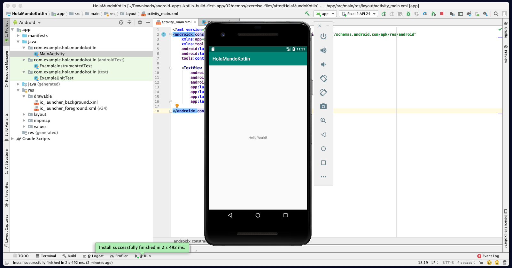
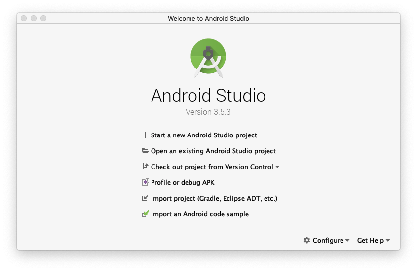
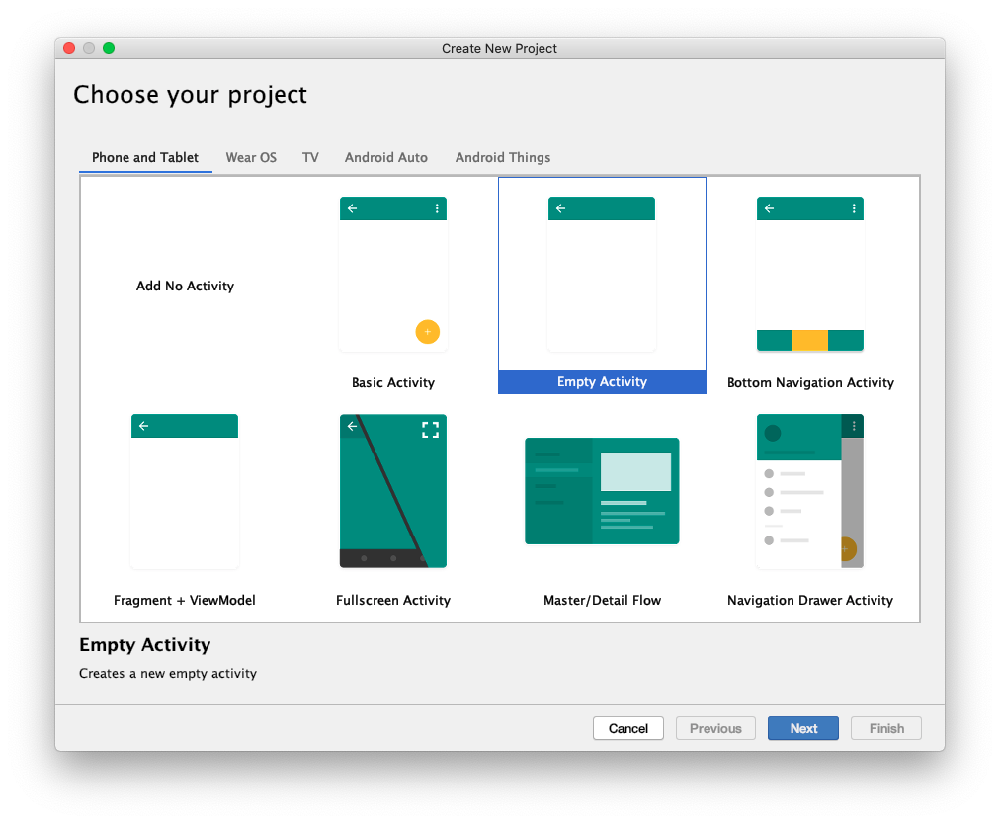

## Sesion 01 - Ejemplo 01

### OBJETIVO 
 - El alumno creará su primera apliación en Android Studio configurando Kotlin como el lenguaje de programación y ejecutara en un dispositivo virtual. 

#### REQUISITOS 

* Android Studio instalado

#### DESARROLLO
La primera vez que iniciamos Android Studio nos monstrará una pantalla de bienvenida parecida a la que tenemos aquí abajo.

1. Para empezar a crear un proyecto nuevo, seleccionamos la opcion **Start a new Android Studio Project**.
 

 2. A continuación elegimos el templete para nuestra apliación, en nuestro caso elegimos **“Empty Activity”**.
 

 

 3. Vamos a configurar nuestro proyecto.

    a. Ingresamos un nombre para nuestra apliación.

    b. Ingresamos un nombre para tu equipo. **(Todo tu equipo debe usar el mismo nombre).**

    c. Selecionar **Kotlin** como lenguaje de la aplicación.

    d. En la opción Minimum API level, seleccionar el SDK: **KitKat**

 

 4. Una vez creado el proyecto, vamos a tener la siguiente ventana, donde en la parte izquierda encontramos el árbol con las carpetas y archivos del proyecto.
 
  
  
 5. Seleccionaremos la opción de dispositivos virtuales disponibles y seleccionaremos la opción Open AVD Manger

  
  
 6. Una vez desplegada la pantalla emergente, tendremos una lista de dispositivos disponibles y seleccionaremos el botón para crear un Dispositivo Virtual
	
	

 7. Nos desplegara una lista de dispositvos con diferentes tamaños de pantalla, seleccionaremos la opción por defecto (Pixel 2) y realizaremos click en **Next**
	
		
	
 8. A continuación seleccionaremos la versión de sistema operativo de nuestro dispositivo, si tenemos claro que versión utilizar, daremos click en **API level distribution chart** (Nos desplegara un gráfico con el porcentaje de dispositvos en el mercado que soportan dicha versión,)
 
 	

 	
 
 **Se recomienda utilizar la versión con mayor porcentaje posible, que contenga las librerías necesarias para nuestro proyecto**
 
9. Para nuestro ejemplo trabajaremos con **Nougat** y una vez seleccionado dar click en **Next**
	
 	

10. El asistente nos mostrara una ultima ventana, en la cual designaremos el nombre con el cual edintificaremos nuestro dipositivo virtual y la orientación inicial, para terminar el proceso de creación realizaremos click en **Finish** 

 	
 
  **Una vez creado nuestro dispositvo cerraremos la ventana emergente**

11. Seleccionaremos la pestaña activity_main.xml 

 	
 
12. Una vez desplegada seleccionaremos en la parte inferior la pestaña text, donde podremos observar la extructura de nuestra vista, en la etiqueta TextView

 	
 
13. Ejecutaremos nuestra aplicación con el boton **RUN** o por medio del Shortcut **^R**

 	
